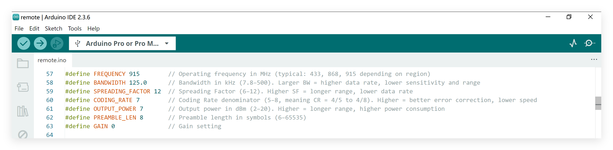

# 4-Channel LoRa Remote Controller

# Makerfabs

[Makerfabs home page](https://www.makerfabs.com/)

[Makerfabs Wiki](https://wiki.makerfabs.com/)


## Intruduce

Product Link : [4-Channel LoRa Remote Controller]()


## Usage

This project uses a 4-channel Lora remote controller to independently control [4-Channel Lora Relay 10A](https://www.makerfabs.com/4-channel-lora-relay-10a.html). Each button on the remote corresponds to a specific relay, allowing users to remotely switch devices on or off with ease. 

Each remote controller has a unique ID assigned to control its corresponding relay channel. By default, the remote and relay are pre-paired and ready for use. If a remote needs to be replaced, the relay can be re-bound to the new remote ID using the pairing function, ensuring stable and continuous system operation.

### How to Pair?

- Short the RX pin and GND of the **4-Channel Lora Relay** using tweezers or a jumper wire
- Press the reset button to enter pairing mode. 
- Press any button on the **4-channel Lora remote controller**. 
If the remote's green indicator light flashes briefly, it means the pairing was successful. 


After pairing, the remote can be used to control the corresponding relay channel.

## Firmware

If you want to adjust the LoRa parameters or add other features, feel free to modify the code directly.



**Build Environment**

```c++
/*
Library version:
Arduino IDE v2.3.6
Arduino AVR Board v1.8.6
RadioLib v4.6.0

Tools:
Board: Arduino Pro or Pro Mini
Processor: ATmega328P(3.3V, 8 MHz)
*/
```

- Install Arduino AVR Board v1.8.6


- Install RadioLib v4.6.0


- Set the parameters of the tools as shown in the picture below.


- Upload the code

